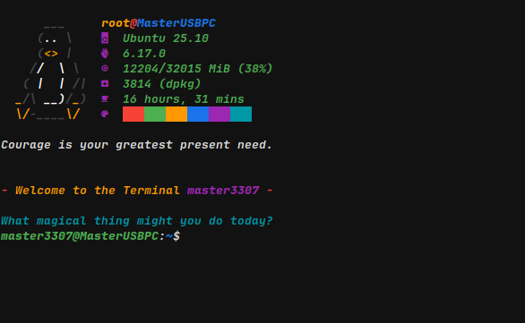

# Please god review this code before you install it. Don't blame me for any damage!

You can use
```bash
bash <(curl -fsSL https://masterrc.master3307.org/)
```
to install it with one command. It only works with debian.

You can **update** either by running `bash <(curl -fsSL https://masterrc.master3307.org/)` again or by running `masterrc` after running the install script once.


Commands:
| Command              | Description                                                          |
| -------------------- | -------------------------------------------------------------------- |
| `aptt`               | updates pretty much everything nicely                                |
| `masterrc` | updates just from this repo. |
| `feature`            | installs nerdfetch and fortune                                       |
| `welcome`            | displays the welcome message again                                   |
| `welcum`             | clears and displays the welcome message again (sorry for the name)   |
| `nerdfetch_nopasswd` | when nerdfetch is installed, it removes the need for a sudo password |
| `nerdfetch_passwd`   | when nerdfetch is installed, it adds the need for a sudo password    |
| `hack-install`       | installs cmatrix and btop. look in [.bash_custom](./.bash_custom)    |


I just wanted a quick and easy way to Update all my Stuff and it's just very convenient if it's Public.
Also if you want it, you can use it yourself.

All it does is Update stuff nicely and set my custom stuff in the bash source.



as you see it basically does following:
```bash
# the thing with the Penguin
sudo nerdfetch

# The random fortune message (offensive ones included)
fortune

echo some text with neat animation

echo some other text with neat animation
```
of course, it is much more complicated than that.
if you want to see what it actually is, it's
<details>
  <summary>this: (Show code)</summary>

```bash
# custom PS1 line:
PS1='\[\e[1;33m\]< \[\e[0m\]\[\e[1;32m\]\u\[\e[0m\]\[\e[1;31m\]@\[\e[0m\]\[\e[1;34m\]\h\[\e[0m\]\[\e[1;33m\] > \[\e[0m\]\[\e[1;35m\]\w\[\e[0m\]\[\e[1;30m\] \$\[\e[0m\] '

has_cmd() {
  command -v "$1" >/dev/null 2>&1 || command -v "$2" >/dev/null 2>&1
}

welcome() {
  printf "\n"

  if has_cmd nerdfetch /usr/bin/nerdfetch; then
    sudo /usr/bin/nerdfetch
  fi

  printf "\n"

  if has_cmd fortune /usr/games/fortune; then
    /usr/games/fortune -a
    printf "\n\n\n"
  fi

  # Message 1
  local delay="${2:-0.01}"
  local char
  while IFS= read -r -n1 char; do
    printf "%s" "$char"
    sleep "$delay"
  done <<< "$(printf '\033[31m- \033[0;33mWelcome to the Terminal \033[1;35m%s\033[0m \033[31m-\033[0m' "${USER}")"
  printf "\n"

  # Message 2
  delay="${2:-0.01}"
  while IFS= read -r -n1 char; do
    printf "%s" "$char"
    sleep "$delay"
  done <<< "$(printf '\033[0;36mWhat magical thing might you do today?\033[0m')"
  printf "\n\n"
}

welcome # dear user :3
# You are so great :D
```
</details>

that was merely a snippet of how the [Preview](./preview.png) is made.

You can look at [this](./.bash_custom) to see what it is actually made of.


the file was made with a little [AI](https://perplexity.com) and [myself](https://github.com/master3307) who is actually learning how to do *bash* with this very project XD 
