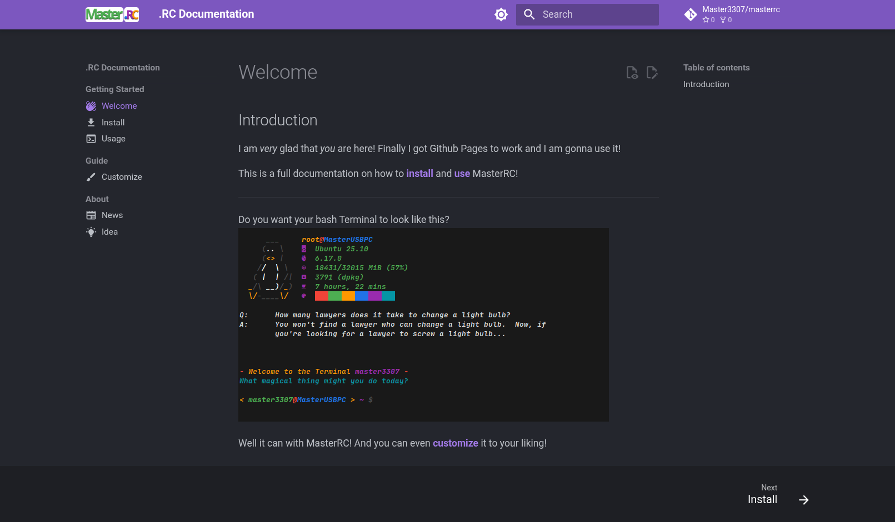

# News

## 003 - Tired

---
I am pretty tired as I am writing this. I finally filled the [Usage](usage.md) page. I still have to add the [Customize](customize.md) page. There aren't even any cutomization options yet XDD

Will have to add them I guess..

also I want to add more settings commands. I think that might be nice.

and more commands in general. we can make this big! ahahahahaahaa

*good night!*

## 002 - README

---
lol, I just made the README much smaller and simpler.

wanna see the old one?

[here it is!](README_old.md)

Truly a relic.

## 001 - Changelog added

---
So, I just added the changelog. This will be more me just taking about what I am working on right here. Kind of like news, so I named it "News". 

Things I got so far in these docs is [Welcome](index.md) and [Idea](idea.md).

The page currently looks like this:

just so you, dear viewer of this relic, can see what I am working on. I will update this page whenever I have something to say about the project or the docs. And I really just want to express any random stuff about developing this here.

So I honestly use some AI, mainly Perplexity to write me some functions and other stuff. I am able though to write simple things myself, but the code is not really good and this is more simple.

So.. if you are reading this and want to contribute to anything here really, feel free to make PR's! Maybe even add your own update code to the `aptt` command or some of your own ideas, spell corrections or preferences if you like. I would be endlessly happy for everything!

Will add here to the News if I got something new :D
