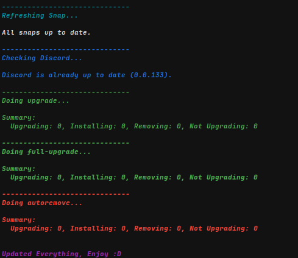

# Idea

## Basic Idea

---
So originally I just wanted to give my bash some extra commands and customization, so I created [`.bashrc_custom`](https://github.com/Master3307/masterrc/blob/master/.bash_custom) with the help of [Perplexity](https://perplexity.ai/).

With this I started to learn a bit of bash myself. I learned how to create my own aliases and simple functions. So the first that I did was the `aptt` command. Originally it just updated all of apt, flatpak, Discord and the *MasterRC* script.

## A little about myself

---
I always try to make things look nice and clean and I think I was able to do this here too.

For example:

??? example "The output of the aptt command"
    ```
    < master3307@MasterUSBPC > ~ $ aptt

    ------------------------------
    Updating Masterrc...


                ----------------
    Downloading ~/.bash_custom

    Source line already in ~/.bashrc

                ----------------
    Done, Installed/Updated masterrc.
    ... and have fun with whatever you just installed :3

    Feel free to try "aptt" in a Terminal. It updates everything.
    Also.. you can run "feature" to install additional features and !

    Reload your shell with: source ~/.bashrc


    ------------------------------
    Updating Flatpak...

    Looking for updates…

    Nothing to do.

    ------------------------------
    Updating APT...

    Hit:1 https://playit-cloud.github.io/ppa/data ./ InRelease
    Hit:2 http://de.archive.ubuntu.com/ubuntu questing InRelease                                                                                                                                                                                    
    Hit:3 https://repository.spotify.com stable InRelease                                                                                                                                                                                           
    Hit:4 https://linux.teamviewer.com/deb stable InRelease                                                                                                                                                                                         
    Hit:5 http://de.archive.ubuntu.com/ubuntu questing-updates InRelease                                                                                                                                                      
    Hit:6 http://de.archive.ubuntu.com/ubuntu questing-backports InRelease                                                                                                                              
    Hit:7 https://repo.waydro.id questing InRelease                                                                                                                                                     
    Hit:8 https://repository.mullvad.net/deb/stable stable InRelease                                                                                                             
    Hit:9 http://security.ubuntu.com/ubuntu questing-security InRelease                                             
    Hit:10 https://pkg.cloudflare.com/cloudflared any InRelease                               
    Get:11 https://pkgs.tailscale.com/stable/ubuntu questing InRelease  
    Hit:12 https://ppa.launchpadcontent.net/papirus/papirus/ubuntu questing InRelease
    Fetched 6.584 B in 1s (6.817 B/s)
    All packages are up to date.    

    ------------------------------
    Refreshing Snap...

    All snaps up to date.

    ------------------------------
    Checking Discord...

    Discord is already up to date (0.0.133).

    ------------------------------
    Doing upgrade...

    Summary:                        
    Upgrading: 0, Installing: 0, Removing: 0, Not Upgrading: 0

    ------------------------------
    Doing full-upgrade...

    Summary:                        
    Upgrading: 0, Installing: 0, Removing: 0, Not Upgrading: 0

    ------------------------------
    Doing autoremove...

    Summary:                        
    Upgrading: 0, Installing: 0, Removing: 0, Not Upgrading: 0


    Updated Everything, Enjoy :D
    ```
I even color coded everything!



---
Overall I like to make scripts that might be useful or customize anything I got nicely and conveniently. And I actually just wanted to make this conveniently public so I could easily update it after adding new stuff to github. Then it got more and more "production ready". I made some small additions to make it work on multiple Systems and made it kind of user friendly. I think I did, yes XD

You have to decide that for yourself though. I really like how it is looking right now.

## Before GitHub

---
So before I had this repo I just used <https://server.master3307.org>, my Fileserver made from [CopyParty](https://github.com/9001/copyparty), to host the [`.bashrc_custom`](https://github.com/Master3307/masterrc/blob/master/.bash_custom) file. It was horrible XD

I had to open the file in <https://server.master3307.org> and edit it there each time I wanted to update it. That got really annoying really quickly. So I simply made this GitHub repository to publicly host the files and edit them from my home PC via [Kate](https://kate-editor.org/) at first.

Now I use VS Code for editing the code though. I enjoy it and I used it some time ago with <https://home.master3307.org>... (purely  written with AI btw. Using GitHub Copilot and ChatGPT at the time.)

## Final thoughts

---
I am insanely glad that I made this and that people I showed this to find it pretty cool. If you, dear reader, are interested in contributing, feel free. Really.

I would be very happy.

Have a great day! :D
