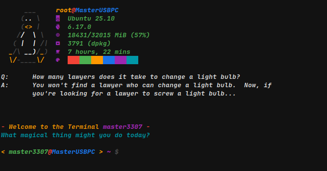

# Welcome

## Introduction

I am *very* glad that *you* are here!
Finally I got Github Pages to work and I am gonna use it!

This is a full documentation on how to **[install](install.md)** and **[use](usage.md)** MasterRC!

---

Do you want your bash Terminal to look like this?

Well it can with MasterRC! And you can even **[customize](customize.md)** it to your liking!
